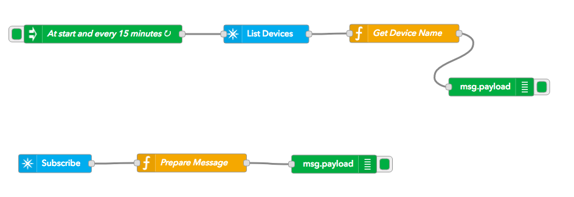
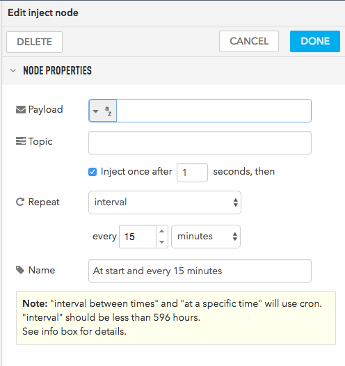
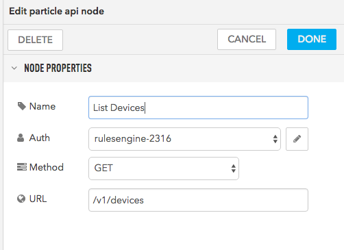
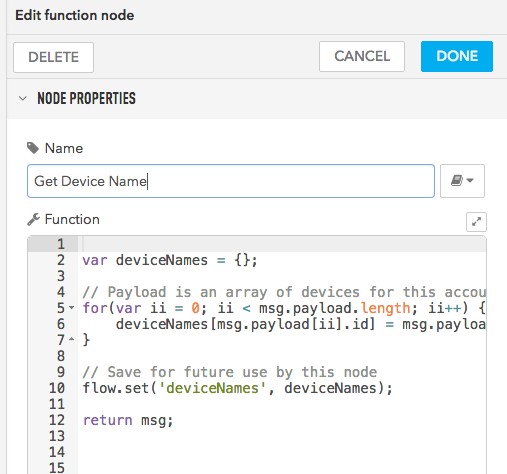
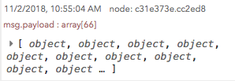
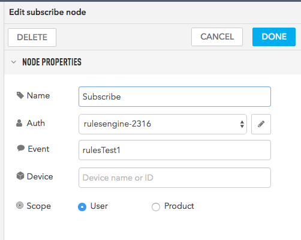
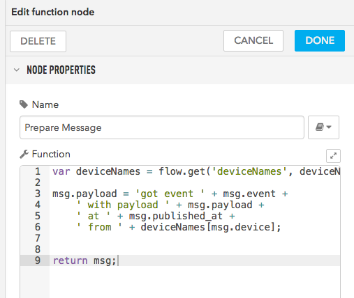
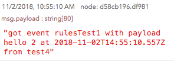

# Device Name Example

This example shows how to retrieve get the device name and use it in a subscription handler.

Here's the complete flow:



## Save the device list

The top part of the flow retrieves the device list at startup and every 15 minutes. This is much more efficient and easier to implement than looking up the device name every time.

Start with an inject node:



Next is a Particle API node to list the devices in the account:



And a function to save the results:



Here's the code:

```
var deviceNames = {};

// Payload is an array of devices for this account
for(var ii = 0; ii < msg.payload.length; ii++) {
    deviceNames[msg.payload[ii].id] = msg.payload[ii].name;    
}
    
// Save for future use by this node    
flow.set('deviceNames', deviceNames);

return msg;   
```

You should see something like this in the debug log after deploying your flow.



You can expand it to see all of the things in the list devices message.

## Subscribe

The second part subscribes to an event using the Particle subscribe node:



We prepare the message using a function node:



Here's the code:

```
var deviceNames = flow.get('deviceNames', deviceNames);

msg.payload = 'got event ' + msg.event + 
    ' with payload ' + msg.payload + 
    ' at ' + msg.published_at + 
    ' from ' + deviceNames[msg.device];


return msg;
```

The first line gets the saved device names that we saved from the top of the flow.

The rest of it generates a message from it.

That's just connected to a debug node for this test.

If you generate the event (see firmware below) you should see something like this in the debug log.



## Firmware

This is the Photon test firmware I used. When you click the SETUP/MODE button, it generates an event that should display in the rules engine.

```
#include "Particle.h"

void buttonClicked(system_event_t event, int param);

int timesSent = 1;
bool clicked = false;

void setup() {
	Serial.begin();
	System.on(button_click, buttonClicked);
}

void loop() {
	if (clicked) {
		clicked = false;
		char buf[256];
		snprintf(buf, sizeof(buf), "hello %d", timesSent++);

		Particle.publish("rulesTest1", buf, PRIVATE);
	}
}


void buttonClicked(system_event_t event, int param) {
	clicked = true;
}

```

