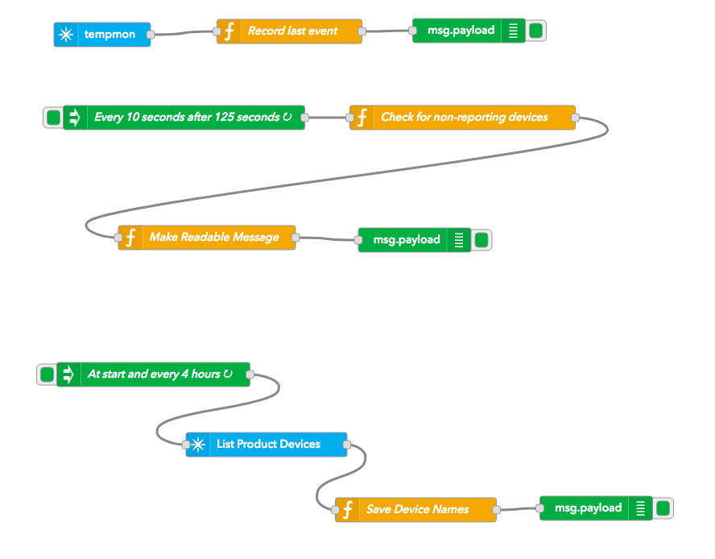

# Product not reporting example

This is an extension of the [Posting to Slack when a device stops responding](https://docs.particle.io/tutorials/iot-rules-engine/real-time-alerting/#posting-to-slack-when-a-device-stops-reporting) but expanded to a fleet of devices.

Here's the completed flow:



## Capture product device list and names

The bottom section of the flow captures the product device list at start and every 4 hours. 


It starts with an Inject node to run the flow at startup and every 4 hours:


And then a Particle API node to List Product Devices:


And a Function node to store the data in a flow variable:


And here's the code

```
// Feedback from the Particle API node

// Create a deviceInfo flow variable if necessary
var deviceInfo = flow.get('deviceInfo');
if (!deviceInfo) {
    deviceInfo = {};
}

// Payload devices is an array of devices in devices for this product
for(var ii = 0; ii < msg.payload.devices.length; ii++) {
    deviceInfo[msg.payload.devices[ii].id] = 
        {
            name:msg.payload.devices[ii].name,
            device:msg.payload.devices[ii].id,
            time:0,
            warnTime:0
        };    
}
    
// Save for future use by this flow    
flow.set('deviceInfo', deviceInfo);

msg.payload = deviceInfo;

return msg;
```

Saving the product device list in the flow is much more efficient than trying to look up a device every time. Plus, it also gets information about all of the devices in the product so non-responding ones can be reported.

## Event subscription flow


This flow starts with a Particle subscribe node. Note that this is a product event subscription node.


A Function node is next to record the time and data in the event when it arrives.


```
var deviceInfo = flow.get('deviceInfo');
if (!deviceInfo || !deviceInfo[msg.device]) {
    // No device list yet, or unknown device
    return null;
}

deviceInfo[msg.device].time = new Date().getTime();
deviceInfo[msg.device].payload = msg.payload;
deviceInfo[msg.device].published_at = msg.published_at;
deviceInfo[msg.device].warnTime = 0;


flow.set('deviceInfo', deviceInfo);

msg.payload = deviceInfo[msg.device].name + ': ' + msg.payload;

return msg;
```

There's a debug node at the end so you can see when events arrive in the debug log as well.


## Check flow

The Check flow does the work of figuring out when devices are not responding. It uses an Inject node to start the flow every 10 seconds after waiting 125 seconds from startup (to allow time for the devices to report the first time).


Next a Function node does the work of checking to see if devices haven't reported:


This is the code:

```
var deviceInfo = flow.get('deviceInfo');
if (!deviceInfo) {
    // No device list yet
    return null;
}

var now = new Date().getTime();

for(var device in deviceInfo) {
    if (deviceInfo[device].time < (now - 2 * 60 * 1000)) {
        // Device has not reported in 2 minutes
        if (deviceInfo[device].warnTime < (now - 10 * 60 * 1000)) {
            // And has not been warned in the last 10 minutes
            
            // Save the warn time
            deviceInfo[device].warnTime = now;
            flow.set('deviceInfo', deviceInfo);
            
            msg.payload = device;
            return msg;
        }
    }
}

return null;
```

For each device in the product, if it has not reported in two minutes, it checks to see if we've warned in the last 10 minutes. If not, the message is passed along to the next node.

Another function node is used to prepare a readable message. This could be passed to Twilio, Slack, email, etc. but here we just debug it.


```
var device = msg.payload;

var deviceInfo = flow.get('deviceInfo');
if (!deviceInfo || !deviceInfo[device]) {
    // No device list yet, or unknown device
    return null;
}

if (deviceInfo[device].published_at) {
    msg.payload = 'No response from ' + deviceInfo[device].name + 
        ', last value was ' + deviceInfo[device].payload +
        ' at ' + deviceInfo[device].published_at;
}
else {
    msg.payload = 'No response from ' + deviceInfo[device].name; 
}
    
return msg;
```

And finally it goes to a debug node.


